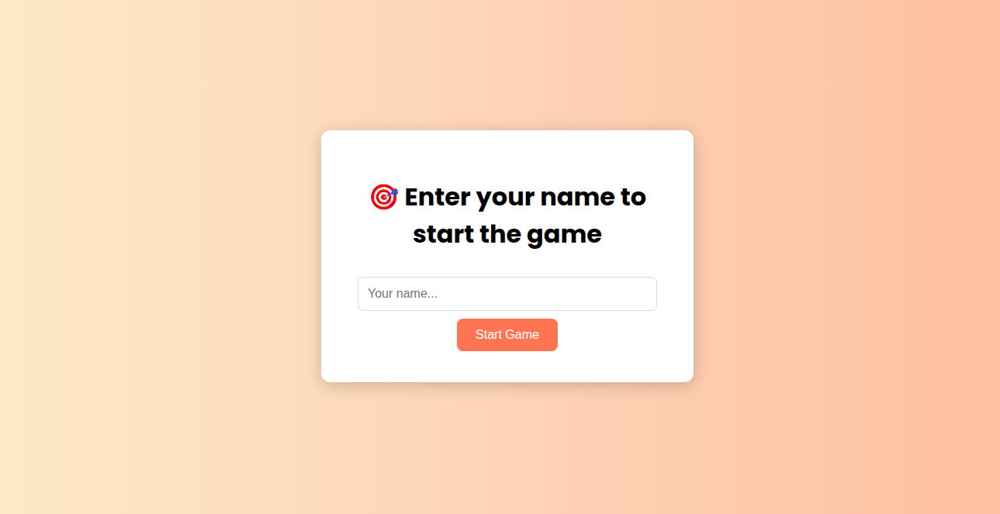
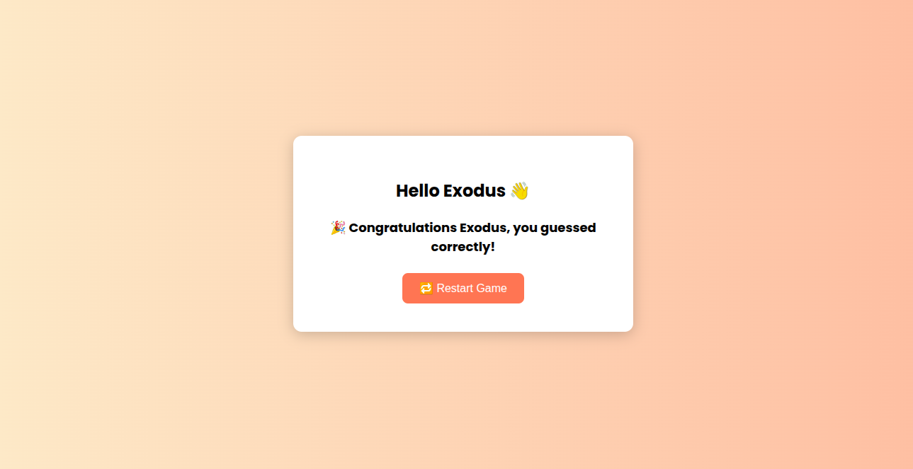

# 🎯 Guess the Number Game (Web Version)

A simple and fun web-based number guessing game built with **Python (Flask)**, **HTML**, and **CSS**.  
The player enters their name to begin and tries to guess a number randomly chosen by the computer between 0 and 100.

---

## 🚀 Features

- 🎮 Interactive guessing with feedback (higher/lower)
- 😃 Personalized greeting using player's name
- ✅ Clean UI with CSS styling and animations
- 🔁 Restart option after a correct guess
- 🌐 Built using Flask (Python web framework)

---

## 📸 Screenshots

| Start Screen | Game Screen | Win Screen |
|--------------|-------------|------------|
|  |  | |


## 📁 Project Structure

guess-number-game/
├── app.py
├── templates/
│ ├── name.html
│ └── game.html
├── static/
│ └── css/
│ └── style.css
└── README.md


---

## 🛠️ Setup Instructions

### 🔧 Prerequisites

- Python 3 installed
- `pip` installed

---

### ⚙️ Installation & Run

```bash
# 1. Clone or download the project
git clone https://github.com/yourusername/guess-number-game.git
cd guess-number-game

# 2. Create a virtual environment
python3 -m venv venv
source venv/bin/activate

# 3. Install Flask
pip install flask

# 4. Run the app
python3 app.py

Then open your browser and go to http://127.0.0.1:5000

### 🧠 How It Works
1. User enters their name to begin the game

2. Flask stores the name and generates a random number (0–100)

User guesses a number

- If correct → success message + restart button

- If wrong → hint to guess higher or lower

User can restart the game anytime


### Technologies Used
- Python 3

- Flask

- HTML5

- CSS3

- Jinja2 (Flask templating)


### TODO / Future Enhancements
- Add difficulty levels (easy, medium, hard)

- Show number of attempts

- Add sound or animation for success

- Save top scores using SQLite